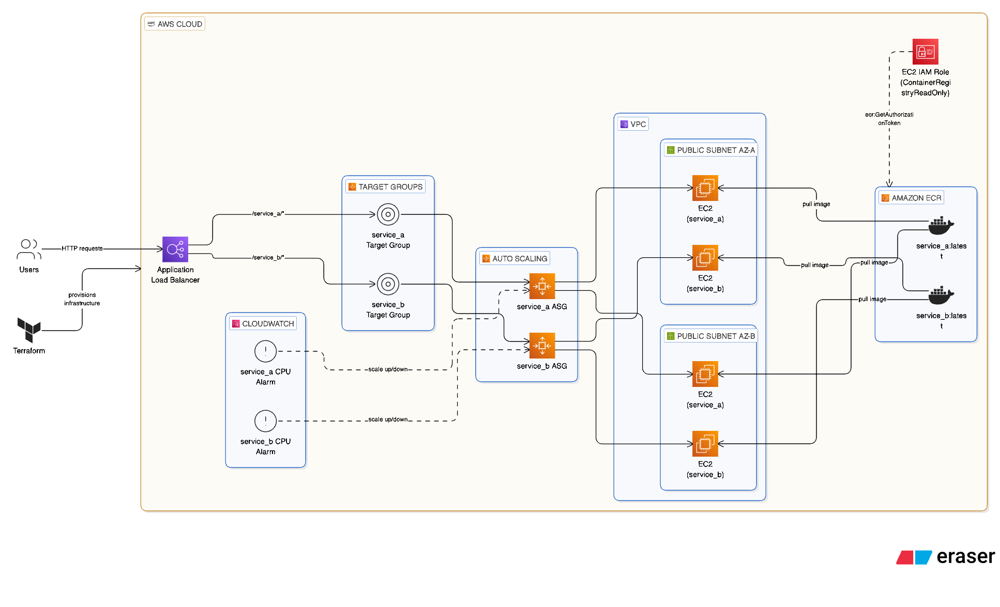

# DevOps AWS Infrastructure Project

## Architecture Overview

This project provisions a highly available, auto-scaled web application infrastructure on AWS using Terraform. The architecture includes:

- **VPC** with two public subnets in different Availability Zones
- **Application Load Balancer (ALB)** for HTTP traffic
- **Auto Scaling Group (ASG)** of EC2 instances
- **ECR** repositories for Docker images
- **IAM** roles and security groups

### Architecture Diagram


## AWS Region

- **Region Used:** `us-west-2`

## Deployment Steps

1. **Clone the repository:**
   ```sh
   git clone <your-repo-url>
   cd devops/infra
   ```

2. **Configure AWS credentials:**
   Ensure your AWS CLI is configured with a profile matching `aws_profile` in `terraform.tfvars` (default: `infra`).

3. **Edit variables:**
   - Update `terraform.tfvars` with your desired values (VPC CIDRs, key pair, AMI, etc). Check out the `terraform.tfvars_sample` for reference.

4. **Initialize Terraform:**
   ```sh
   terraform init
   ```

5. **Apply the Terraform plan:**
   ```sh
   terraform apply -var-file="terraform.tfvars"
   ```

6. **Build and push Docker images:**
   - Tag and push your service images to the ECR repositories created by Terraform.
   ```sh
   docker buildx build --platform linux/amd64 -f <service_directory>/Dockerfile -t <aws_account_id>.dkr.ecr.<region>.amazonaws.com/<repository_name>:<tag> --push .
   ```

7. **Verify deployment:**
   - Find the ALB DNS name from the AWS Console or Terraform output.
   - Test endpoints:
     ```sh
     curl http://<alb-dns-name>/service_a
     curl http://<alb-dns-name>/service_b
     ```

## Running the Verification Script

A script `verify_endpoints.sh` is provided in the `services/` directory to check the health of your deployed services.

1. Make the script executable:
   ```sh
   chmod +x verify_endpoints.sh
   ```
2. Run the script, passing your ALB DNS name:
   ```sh
   ./verify_endpoints.sh <alb-dns-name>
   ```

---
## Cleanup
To destroy the infrastructure and avoid ongoing costs, run:
```sh
terraform destroy -var-file="terraform.tfvars"
```
--
## GitHub Actions
A GitHub Actions workflow is set up to validate Terraform code on pull requests. The workflow file is located at `.github/workflows/terraform.yml`. It runs `terraform fmt` and `terraform validate` to ensure code quality and correctness before merging changes.
